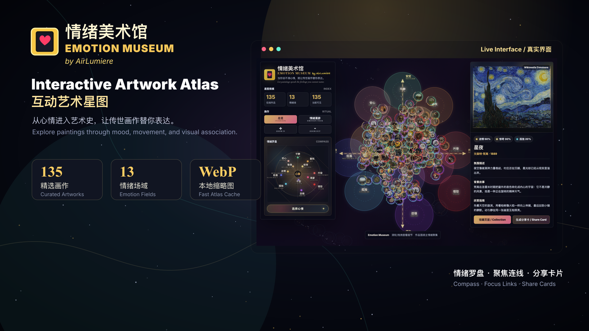

# 情绪美术馆

**情绪美术馆** 是一个以情绪为入口的互动艺术星图。它把传世画作放入一张可漫游的情绪地图中，让用户不只按照年代、画派或艺术家浏览作品，也可以从“此刻的心情”进入艺术史。

在线演示：<https://emotion-museum.kesenlab.workers.dev>

English documentation: [README.md](./README.md)

[打开 Demo 页面](https://emotion-museum.kesenlab.workers.dev)

## 项目预览



## 项目定位

传统的艺术浏览方式通常围绕时间线、馆藏、作者和流派展开。这些结构非常重要，但并不总是普通人接近图像的第一入口。

情绪美术馆尝试用另一种方式组织画作：

> 当你说不清心情，就让传世画作替你表达。

它既是一个轻量的数字人文原型，也是一个面向大众的艺术浏览体验。

## 核心特点

- **以情绪组织画作**  
  当前包含 13 种情绪场域：平静、安心、喜悦、兴奋、愤怒、渴望、恐惧、不安、低落、孤独、迷惘、敬畏、惊奇。

- **135 幅精选画作**  
  作品主要来自 The Metropolitan Museum of Art 与 Wikimedia Commons 等公开来源。

- **星图式浏览体验**  
  用户可以缩放、漫游、点击画作，查看作品信息、情绪标签、背景故事和欣赏角度。

- **情绪聚焦模式**  
  点击某个情绪后，相关作品会高亮并聚焦，画作与情绪之间会形成连接关系。

- **情绪漫游模式**  
  支持手动切换不同情绪，以更沉浸的方式浏览作品和情绪文字。

- **分享卡生成**  
  每幅作品都可以打开分享卡预览，包含作品信息、情绪解读和作者介绍。

- **已优化首屏加载**  
  星图默认加载轻量 WebP 缩略图，详情面板和分享卡再加载高清图。

## 快速开始

```bash
npm install
npm run dev
```

Wrangler 会输出本地访问地址。

## 部署到 Cloudflare

创建具备 Workers 部署权限的 Cloudflare API Token，然后执行：

```bash
CLOUDFLARE_API_TOKEN="your-token" npm run deploy
```

不要把 API Token 写入代码或提交到 GitHub。请使用环境变量或 GitHub Secrets。

## 项目结构

```text
public/
  index.html                         # 主页面
  art-nebula-assets/
    manifest.json                    # 本地图像与缩略图索引
    met-expansion.json               # 画作数据
    local-data.js                    # 离线数据包
    images/                          # 本地高清图
    thumbs/                          # 星图缩略图
    export-data/                     # 分享卡 PNG/JPG 导出用按需图片数据
  vendor/                            # 浏览器端图片导出依赖
github-assets/
  output/                            # README 主视觉配图
src/
  worker.js                          # Cloudflare Worker 入口
wrangler.toml                        # Cloudflare 部署配置
ATTRIBUTIONS.md                      # 画作来源说明
```

## 版权与来源

本项目的应用代码使用 MIT License。

画作图片与画作元数据不包含在 MIT License 中，它们仍然遵循原始馆藏机构或来源项目的版权、授权和使用条款。复用或再分发图片前，请查看 [ATTRIBUTIONS.md](./ATTRIBUTIONS.md) 中列出的来源链接。

## 设计说明

情绪美术馆把“情绪”当作空间界面。每幅作品最多对应三种情绪，初始星图会结合情绪坐标和自然星云式分布，让画作既有情绪指向，又保持有机、可漫游的视觉状态。

当用户选择某个情绪时，相关作品会被聚焦到该情绪场域中；当用户回到总览时，画作会重新散布到整张情绪地图里。

## 后续方向

- 补充更完整的画作版权与授权字段。
- 增加画作导入和缩略图生成脚本。
- 增加艺术家、年代、流派、来源和情绪搜索。
- 优化移动端布局和无障碍体验。
- 增加英文作品解读或中英切换。
- 在项目变大后，将当前单 HTML 应用拆分为更清晰的模块结构。

## 贡献

欢迎提交改进，尤其是：

- 画作元数据修正
- 情绪分类校正
- 性能优化
- 移动端和无障碍体验
- 新的艺术浏览方式

新增图片或数据时，请保留清晰的来源和授权说明。
